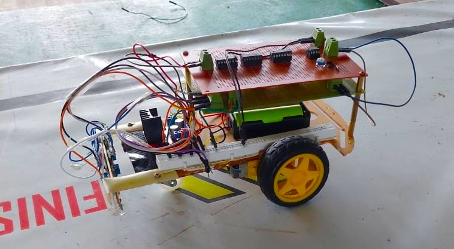
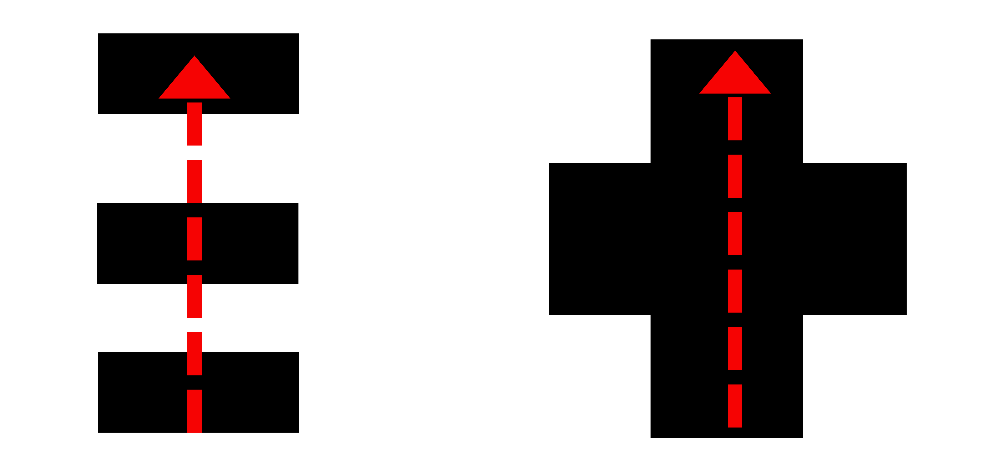
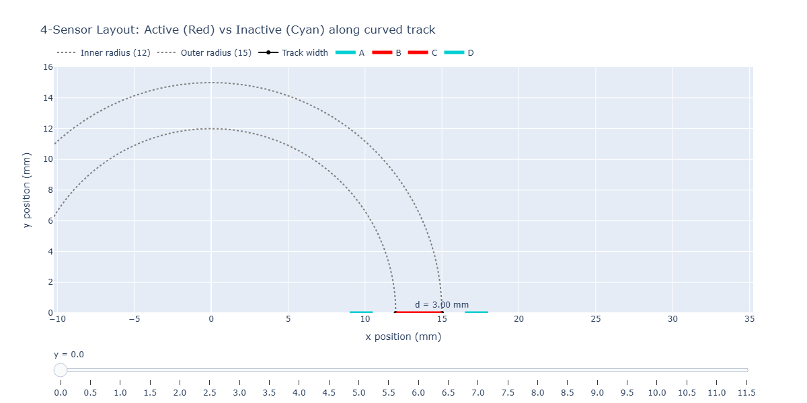
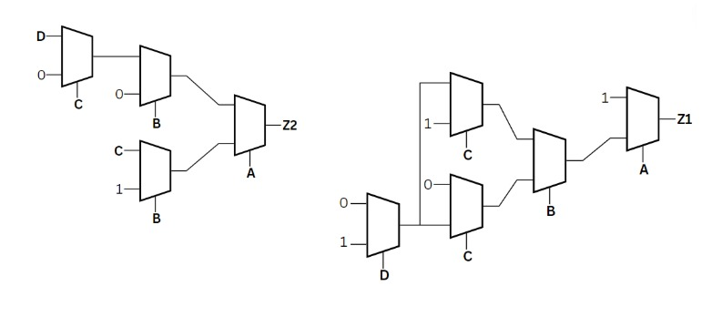

#  Line Following Robot Using Combinational Logic Control

A hardware-based line-following robot built using **4-input IR sensors**, **74HC157 multiplexers** for combinational logic control, and a **self-made PWM generator** for motor speed control.

**Constraints:**
- Logic must be implemented using multiplexers (no microcontroller)
- Motor speed control via a self-designed PWM generator
- 4 IR sensors as the only sensing modality



---

## Repository Structure

```
line-following-robot/
├── README.md 
├── simulation/
|   ├── SCRIPTS/
│   |   └── PWRRAILS.DAT 
│   ├── ROOT.DSN                     
│   ├── ROOT.CDB                     
│   └── PROJECT.XML                  ← Proteus project file
│                  
└── analysis/
    └── line-following-robot.ipynb   ← Sensor placement geometry analysis

```

## System Overview

```md
 [IR Sensor Array]  →  [MUX Control Logic]  →  [PWM Generator]  →  [DC Motors]
   A  B  C  D             Z1  Z2                  PWM L / PWM R      Left / Right
```

### Signal Definitions

| Signal | Description             |
|--------|-------------------------|
| A      | IR Sensor 1 input       |
| B      | IR Sensor 2 input       |
| C      | IR Sensor 3 input       |
| D      | IR Sensor 4 input       |
| Z1     | Output 1 (left motor)   |
| Z2     | Output 2 (right motor)  |

> **Sensor logic:** Output is `1` (HIGH) when sensor is **over the line** (dark surface detected).

## Truth Table

The control logic was derived from 12 defined input combinations covering all navigation cases:

| No | A | B | C | D | Z1 | Z2 | Action      |
|----|---|---|---|---|----|----|-------------|
| 1  | 0 | 1 | 1 | 0 | 1  | 1  | Go Straight |
| 2  | 0 | 0 | 0 | 0 | 1  | 1  | Go Straight |
| 3  | 1 | 1 | 1 | 1 | 1  | 1  | Go Straight |
| 4  | 0 | 0 | 1 | 0 | 0  | 1  | Turn Right  |
| 5  | 0 | 0 | 1 | 1 | 0  | 1  | Turn Right  |
| 6  | 0 | 1 | 0 | 0 | 1  | 0  | Turn Left   |
| 7  | 1 | 1 | 0 | 0 | 1  | 0  | Turn Left   |
| 8  | 1 | 1 | 1 | 0 | 1  | 0  | Turn Left   |
| 9  | 0 | 1 | 1 | 1 | 0  | 1  | Turn Right  |
| 10 | 1 | 0 | 0 | 0 | 1  | 0  | Turn Left   |
| 11 | 0 | 0 | 0 | 1 | 0  | 1  | Turn Right  |

> **Special Case:** Input `0000` (all sensors off-line) and `1111` are mapped to **Go Straight** (Z1=1, Z2=1), assuming the robot is momentarily between lines and should continue forward.



> **Output Key:** Z1=1, Z2=0 → Turn Left &nbsp;|&nbsp; Z1=0, Z2=1 → Turn Right &nbsp;|&nbsp; Z1=1, Z2=1 → Go Straight

### Don't Care Conditions

The following 5 input combinations are treated as **don't cares (X)** — they are physically assumed to never occur given the sensor placement and 30 mm line width:

| A | B | C | D | Z1 | Z2 |
|---|---|---|---|----|----|
| 0 | 1 | 0 | 1 | X  | X  |
| 1 | 0 | 0 | 1 | X  | X  |
| 1 | 0 | 1 | 0 | X  | X  |
| 1 | 0 | 1 | 1 | X  | X  |
| 1 | 1 | 0 | 1 | X  | X  |

> These combinations would require non-adjacent sensors to trigger simultaneously, which cannot happen with a continuous 30 mm line. The MUX hardwiring produces arbitrary outputs for these inputs, but since they never occur in practice, the behaviour is irrelevant.


### Output Interpretation

| Z1 | Z2 | Action      |
|----|----|-------------|
| 1  | 1  | Go Straight |
| 1  | 0  | Turn Left   |
| 0  | 1  | Turn Right  |
| 0  | 0  | Stop        |

## Design Flow

### 1. Sensor Placement Analysis

The actual competition path was physically measured and it was found that **all turns share the same radius**. This allowed us to design and optimize the sensor placement for a single known turn geometry rather than a range of radii.

Based on the measured path dimensions, a geometric simulation was developed (`analysis/line-following-robot.ipynb`) to find the optimum sensor spacing. The simulation sweeps the robot along the measured curve and checks which sensors are over the 30 mm line at each position.

#### Sensor Arrangement

The 4 sensors are arranged as follows, with **no gap between the two middle sensors** so that together they fully cover the 30 mm line width:

```
 ←————————————————————————————————→
 [ A ]  [ B ][ C ]  [ D ]
  RT     RT   TR     TR
```

| Sensor | IR Pair | Role |
|--------|---------|------|
| A | T → R (RT) | Outer left — detects severe left drift |
| B | T → R (RT) | Inner left — detects moderate left drift |
| C | R ← T (TR) | Inner right — detects moderate right drift |
| D | R ← T (TR) | Outer right — detects severe right drift |

> The **RT RT TR TR** pattern means sensors A & B have the transmitter on the right and receiver on the left, while C & D have the transmitter on the left and receiver on the right. This arrangement minimizes cross-talk between adjacent sensors.

> B and C have **no gap between them** — their combined width exactly covers the 30 mm track width, ensuring the line is always detected by at least one sensor when the robot is on track.



### 2. Truth Table Construction
All valid sensor combinations were enumerated and mapped to control outputs based on the physical interpretation of where the 30 mm line falls relative to each sensor.

### 3. MUX-Based Logic Implementation
Instead of Karnaugh maps and discrete gates, the combinational logic was implemented directly using **74151 8-to-1 multiplexers**:

- **Z2 (Output 2):** Implemented with a 3-level MUX tree using inputs D, C, B, A
- **Z1 (Output 1):** Implemented with a separate 3-level MUX tree using inputs C, D, B, A

The MUX select lines are driven by the sensor inputs, and the data inputs are hardwired to `0` or `1` based on the truth table entries.



## Bill of Materials

### ICs & Active Components

| Component       | Part No.       | Qty | Description                                       |
|-----------------|----------------|-----|---------------------------------------------------|
| Motor Driver    | L298N          | 1   | Dual full-bridge motor driver (H-bridge)          |
| Multiplexer     | 74HC157        | 4   | Dual full-bridge motor driver (H-bridge)          |
| Timer IC        | NE555          | 1   | PWM signal generator (DIL-8 package)              |
| Buffer Gate     | MC74HC126AN    | 2   | Quadruple tri-state buffer gate (active-HIGH OE)  |
| Buffer Gate     | 74HC125        | 2   | Quadruple tri-state buffer gate (active-LOW OE)   |
| IR Sensor       | —              | 4   | Reflective IR sensor modules (RT RT TR TR layout) |

### Passive Components

| Component         | Value          | Qty | Notes                                        |
|-------------------|----------------|-----|----------------------------------------------|
| Zener Diode       | 1N4733A (5.1V) | 4   | Protection diodes (DO-41 package)            |
| Capacitor         | 10nF           | 2   | NE555 timing capacitors                      |
| Resistor          | 1kΩ            | 4   | Pull-up / current limiting (RES180 package)  |
| Variable Resistor | 10kΩ pot       | 2   | PWM duty cycle adjustment                    |

### Hardware & Mechanical

| Item                  | Spec / Notes                          | Qty |
|-----------------------|---------------------------------------|-----|
| Robot Chassis         | Custom / off-the-shelf frame          | 1   |
| DC Motor + Tire       | Geared DC motor + wheel               | 2   |
| Li-ion Battery        | 3.7V lithium-ion cell                 | 2   |
| Dotboard (Stripboard) | For circuit assembly                  | 2   |
| Jumper Wires          | Male-to-male and male-to-female       | —   |

### Software & Tools

| Tool     | Purpose                              |
|----------|--------------------------------------|
| Proteus  | Schematic capture and simulation     |
| Jupyter  | Sensor placement geometry analysis   |


##  Arena Specifications

| Parameter       | Value     |
|-----------------|-----------|
| Arena Size      | 8′ × 4′   |
| Line Width      | 30 mm     |
| Line Color      | Black     |
| Surface         | White     |


## Design Decisions & Challenges

- **`0000` input handling:** When all sensors read no line, the robot defaults to Go Straight rather than stopping, preventing stalls at junctions or tight curves where no single sensor may be active.
- **MUX over gates:** Using multiplexers reduces component count and simplifies the logic implementation — the truth table maps directly to MUX data inputs.
- **Custom PWM:** Off-the-shelf PWM ICs were replaced with a self-designed circuit for closer integration with the control logic.
- **Sensor spacing:** Sensor positions were derived analytically to ensure reliable detection on the tightest curves in the 8′ × 4′ arena.

## Acknowledgements

We would like to express our sincere gratitude to **Dr. Janaka Wijayakulasooriya** of the Department of Electrical & Electronic Engineering, Faculty of Engineering, University of Peradeniya, for his invaluable guidance and support throughout this project.

